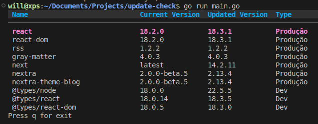

# Update Check

This is a simple Go application using bubbletea to check for updates in a package.json.

## Prerequisites

- Go 1.16 or higher


## Running the Application

To run the application, use the following command:

```sh
go run main.go
```

## Example



## Building the Application

To build the application, use the following command:

```sh
go build -o update-check
```

You can then run the built application:

```sh
./update-check
```